# Evidencias · RA2 SBD (rellenar por el alumnado)

> Completa este documento con capturas/salidas. No incluyas secretos.
> Indica si has usado **Variante A (IAM Role)** o **Variante B (aws configure)**.

## 0) Identificación
- Alumno/a:juan blanco
- Grupo: a
- Variante usada (A/B): aws configure
- Región AWS: us-east-1
- Bucket S3:juancho-sensores

---

## 1) S3 privado
- [ ] Captura del bucket (nombre y región)
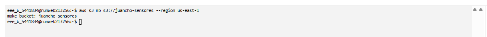
- [ ] Captura/confirmación de que **no es público** (Block Public Access o permisos)
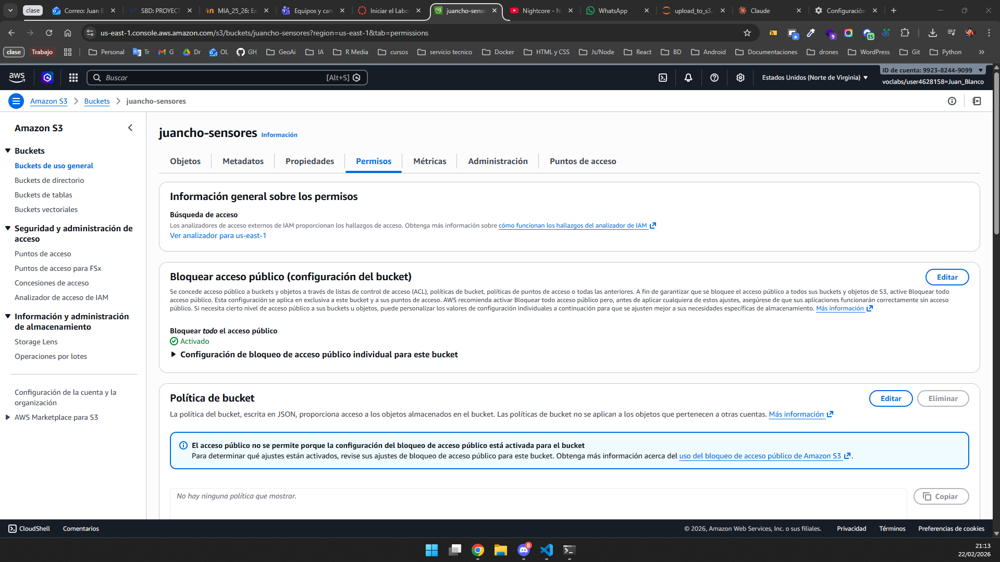
- [ ] Captura del objeto JSON en `data/sensores/`
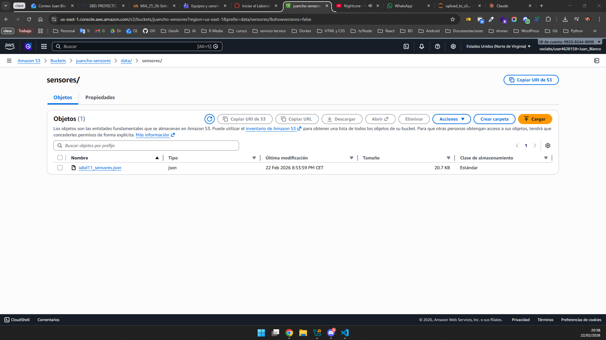
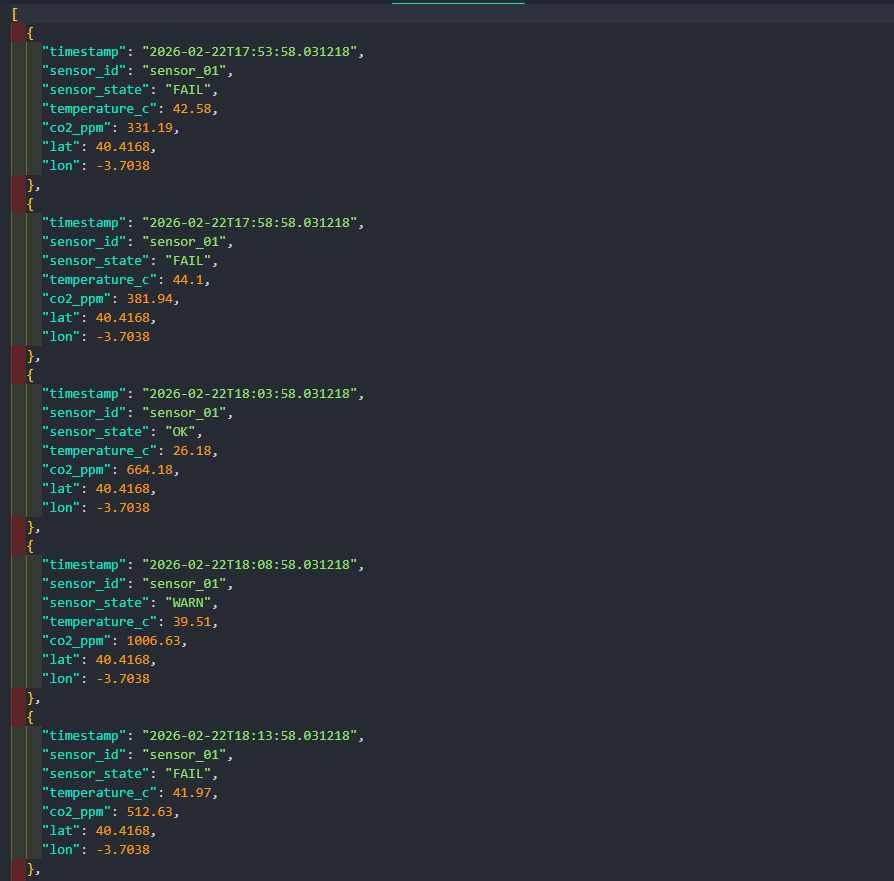


**Notas:**
- Key usada (S3_KEY):S1bkkZ8ZFqkNaDB5ne4dsKk/6S3htGFGoFXvObQr

---

## 2) Notebook / Script de subida
- [ ] Captura de la ejecución del notebook/script subiendo a S3
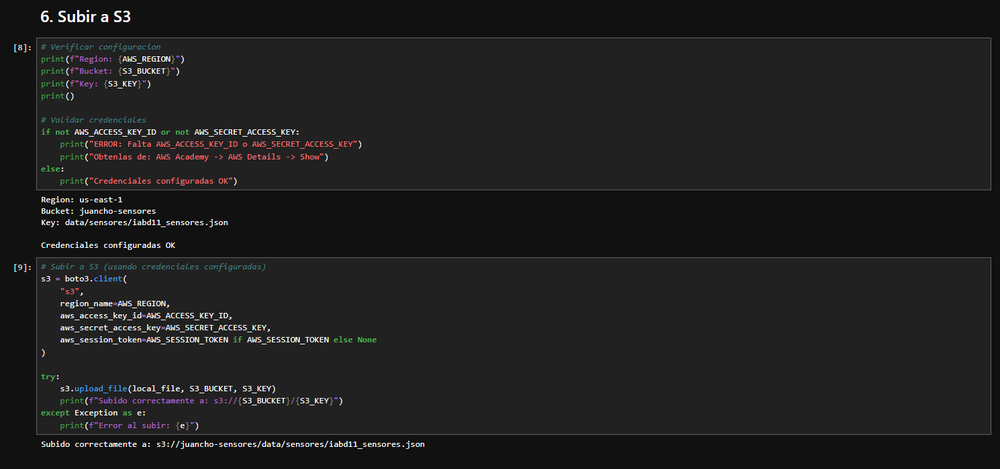
- [ ] Enlace o ruta del archivo en el repo (`notebooks/...`)
(notebooks/upload_to_s3.ipynb)

---

## 3) EC2 y red
- [ ] Captura de la instancia EC2 (Ubuntu 22.04)
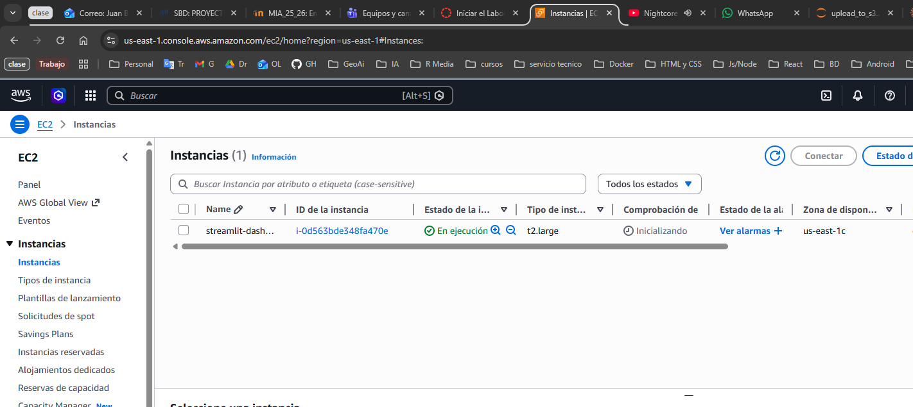
- [ ] Captura del Security Group con puerto 8501 abierto (según reglas del lab)
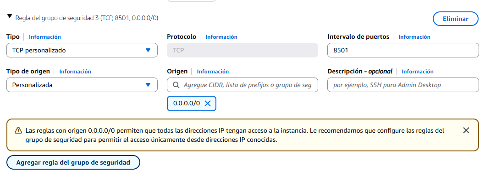
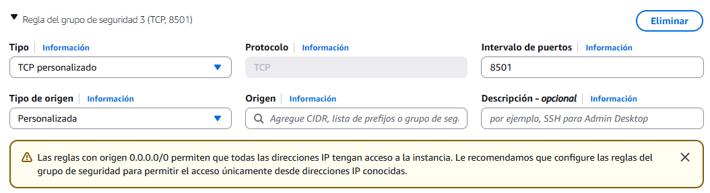

- [ ] Salida de `ssh` conectando (sin mostrar claves)
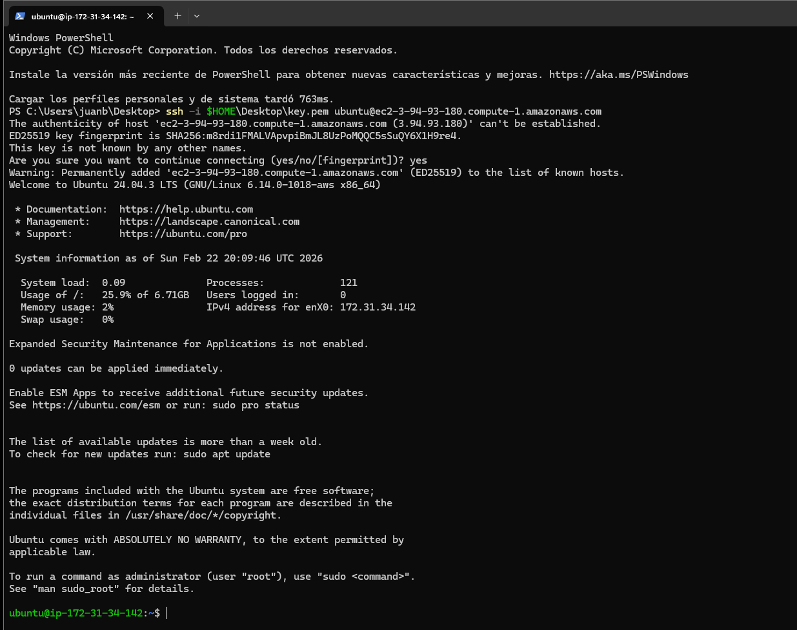

---

## 4) Acceso a S3 desde EC2 (sin secretos)
Ejecuta en EC2:

```bash
aws sts get-caller-identity
aws s3 ls s3://<BUCKET>/data/sensores/
```

- [ ] Captura/salida de ambos comandos
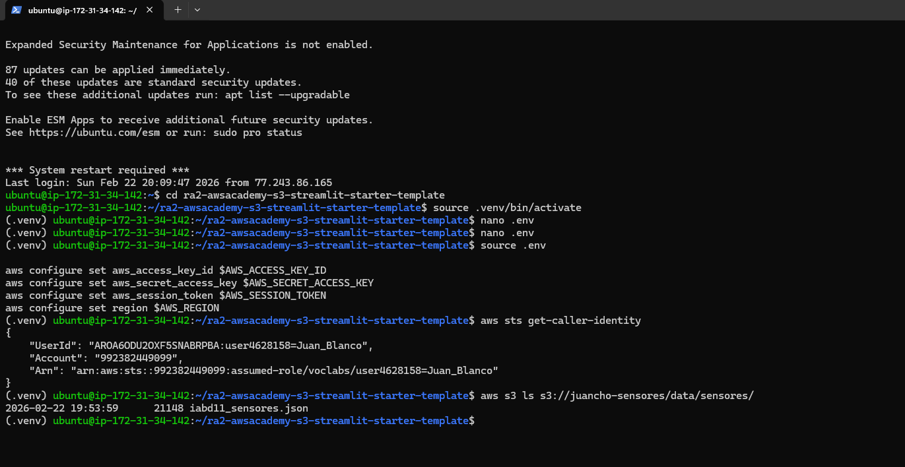
---

## 5) Streamlit en EC2
- [ ] Captura de `streamlit hello` funcionando (o `python -c "import streamlit"`)
- [ ] Captura de instalación de dependencias (`pip install -r requirements.txt`)

---

## 6) Dashboard (funcionalidad)
Incluye capturas donde se vea:

- [ ] Filtro por `sensor_state`
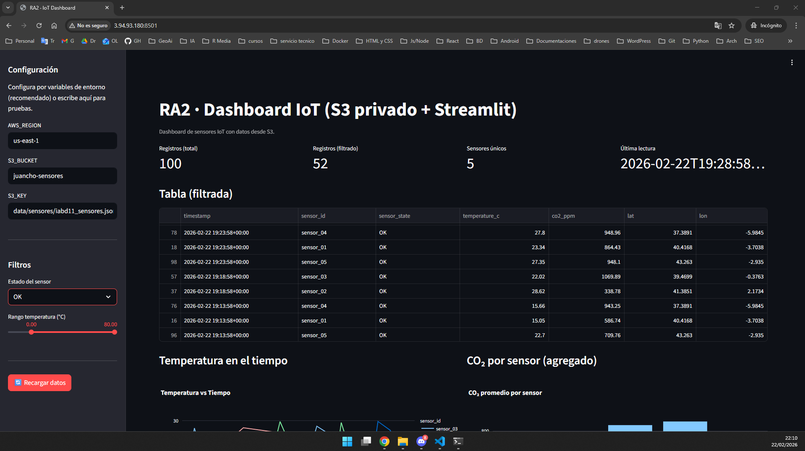
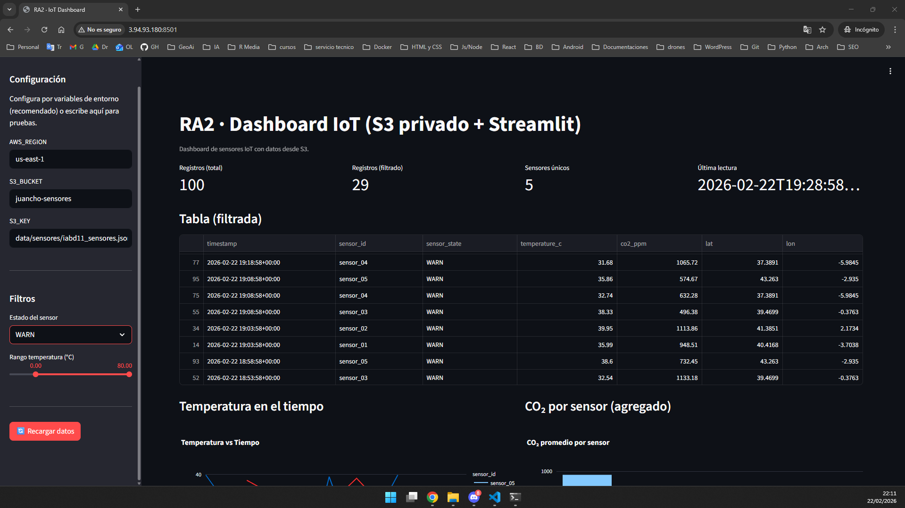
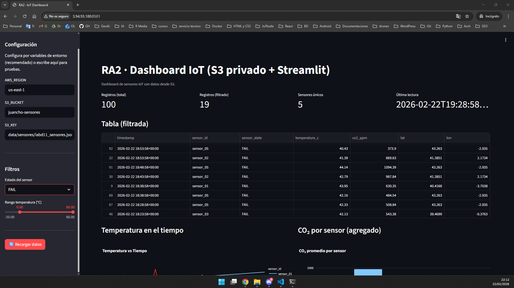

- [ ] Slider de temperatura
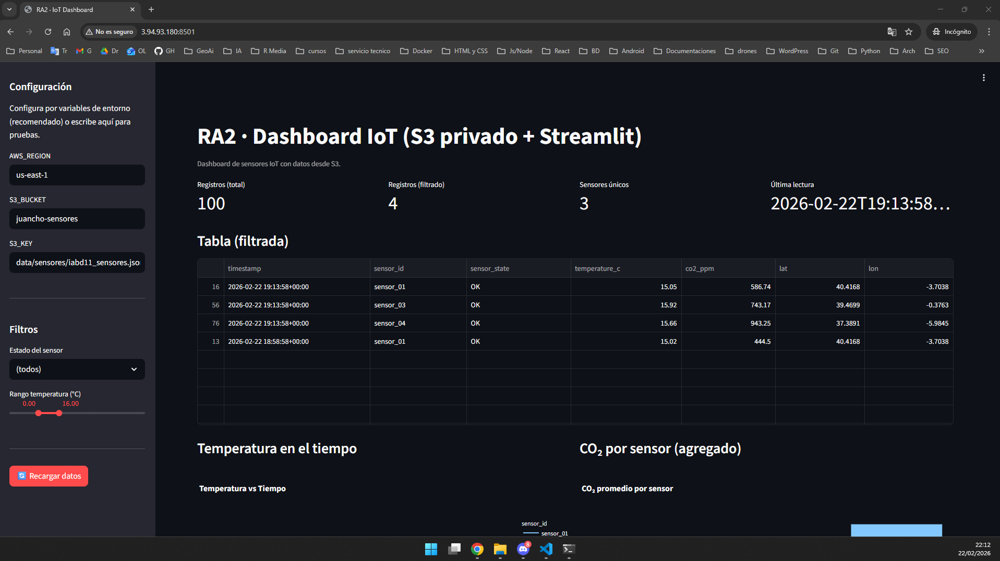

- [ ] Tabla filtrada
- [ ] Gráfica línea (temperatura vs tiempo)


- [ ] Gráfica barras (CO₂ por sensor)
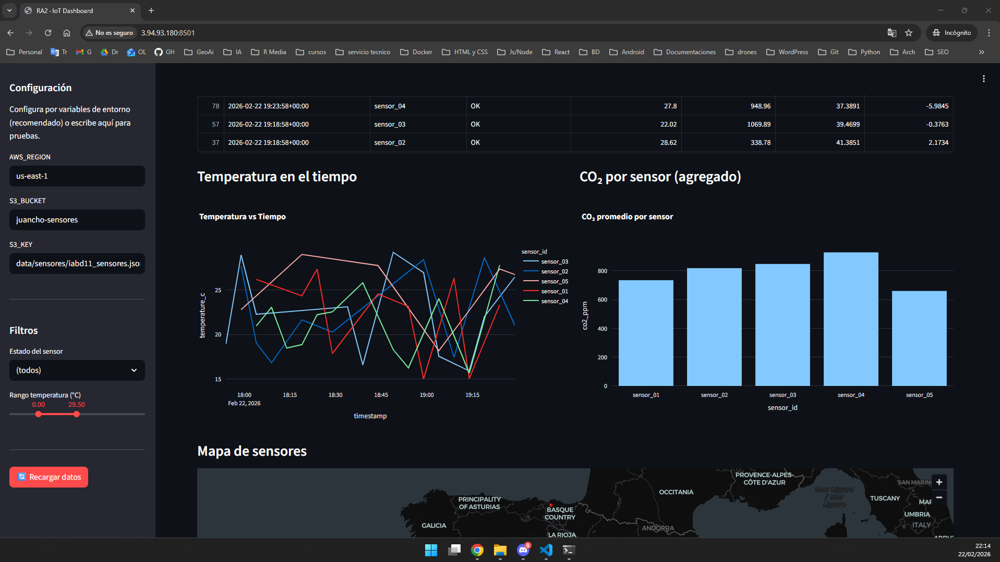

- [ ] Mapa con sensores
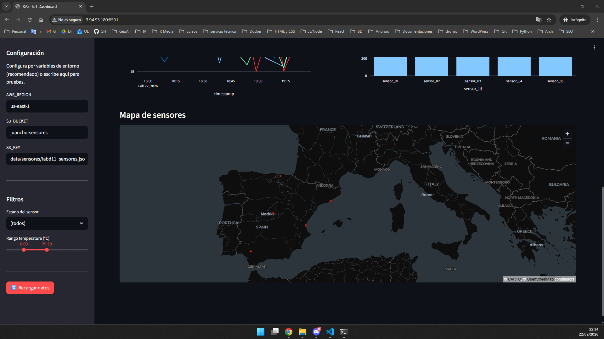

---

## 7) Despliegue final
- [ ] Comando usado para arrancar en segundo plano (ej. `nohup` o script)

- [ ] Captura del log (`tail -n 50 streamlit.log` o similar)

- [ ] URL final:

**URL:** `http://3.94.93.180:8501`

- [ ] Captura en navegador accediendo a la URL
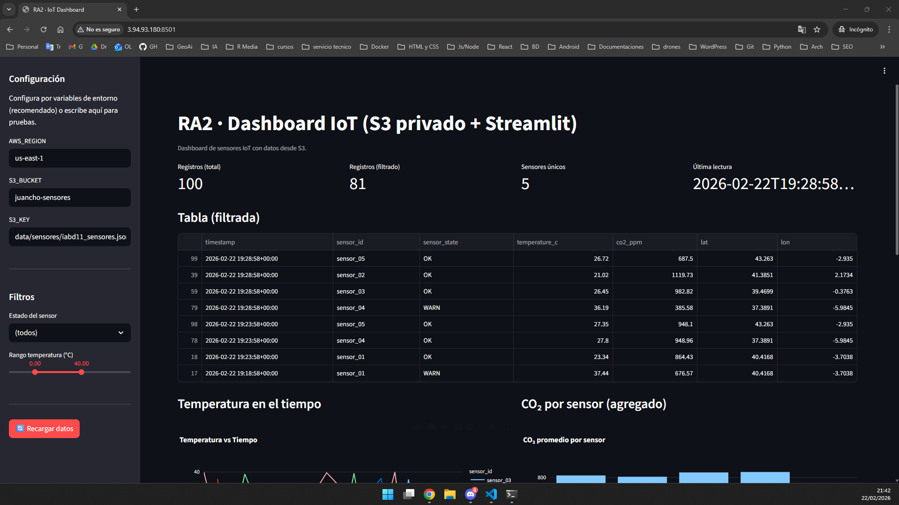

---

## 8) Observaciones (opcional)
- Problemas encontrados y solución: falo en la ejecucion del script: run_streamlit_nohup.sh por que le faltaba el path de python para encontrar el modulo app.
